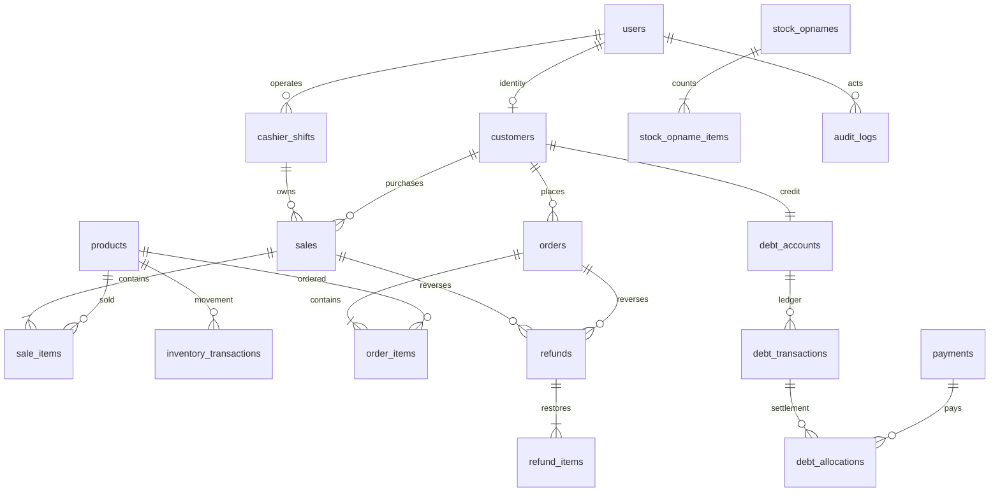

# Warbun: implementation plan

## Baseline
Existing Laravel/Blade POS with Spatie roles, master data, sales, stock movements, orders, payments, debt and shifts. Baseline: 25 tests, 6 pass, 17 fail, 2 error. Auth routes missing; sensitive routes only require auth; POS/payment/order/debt writes are inconsistent. No localization, opname, staff/settings management or verified gateway boundary yet.

## Architecture and feature breakdown
Retain Laravel server rendering, Eloquent and decimal DB columns. Business operations move to transactional services; controllers validate input and return responses. Integer minor units handle money. Product current_stock and account/customer balances are caches updated under locks with immutable movement/ledger entries. Operator operations lock the user before shift work; debt/refund work locks the customer before source transactions. Product rows are locked in ID order. Verified gateway callbacks serialize the order/payment without relying on a cashier shift. Deadlock retries wrap compound writes. Unique UUID references replace count-based numbering. QA uses isolated SQLite and a separate MySQL database. Real concurrent PHP workers verify the last-item sale race on MySQL.

Master data supports catalog/inventory/POS/orders; user/customer identity enables orders and debt; shifts and payments reconcile financial flows; refunds create new records and restore stock/debt; audit records live in the same transaction as business changes. Notifications use Laravel database notifications and named events where needed. No live provider credentials were supplied: implement a configurable verified webhook boundary and offline/manual payment flow, without pretending a live gateway is active.

## ERD

Payments polymorphically reference Sale, Order or DebtAccount; refund_payments ties each returned amount to its original receipt, including FIFO debt repayment allocations. Refunds/allocations retain their source. Master entities category/type/unit/brand/supplier reference products. Spatie owns roles and permissions.

## Migration plan
Add operational tables (opname/items, refunds/items/payment allocations, debt allocations, store settings, notifications); fields for debt remaining, payment shift attribution, refund/source relations and idempotency keys. Backfill remaining debt cautiously from chronological credits in existing records; keep legacy data/history. No destructive resets against existing DB. Unique customer identity fields, user active-shift marker and unique request keys prevent retries/concurrent duplicate writes. Preserve old migrations; run full history in disposable QA DB.

## Flows and business rules
- POS: active own shift; authoritative price unless override permission; aggregate duplicate products; validate active stock, discounts, tender and eligible registered credit customer; atomically write sale/items/movements/payment/debt/audit. Retried request returns existing result.
- Stock: lock product; stock-in/out/adjust require reason; no negative stock; every delta writes movement and audit. Initial product stock uses movement.
- Opname: count expected vs physical; authorized confirmer rejects stale expected count, then records adjustment once.
- Order: authenticated customer checkout reserves by deducting stock once; pending → confirmed → preparing → ready → completed; pending/confirmed/preparing/ready can cancel only if unpaid. Cancellation releases stock once. Paid orders use controlled refund.
- Payment: separate record, partial payments possible; manual settlement validated against remaining amount. Online status only changes via verified provider notification, never customer frontend. Failed/cancelled/expired cannot become paid through arbitrary request.
- Debt: identified active customer, credit eligibility/limit; debit and credit entries immutable; repayments allocate FIFO by due date to open debits; overpayment rejected; adjustments/write-off/reversal require permission, reason and audit. Due today uses calendar day, not midnight isPast.
- Refund: line quantities bounded by unreturned purchased quantity; create refund/items, inventory restoration, payment/debt reversal in one transaction; no deletion of original sale/order.
- Shift: one active shift per staff; expected cash = opening + net cash receipts + cash debt collections - cash refunds attributed to shift; closing records actual/variance under lock.

## Permission matrix
| Role | Operational access | Sensitive access |
| --- | --- | --- |
| super-admin/owner | all | users, roles, settings, refund, adjustment, audit |
| manager | products/inventory/orders/reports/staff | approved stock adjustments; financial approvals require explicit grants |
| cashier | own shift, POS, customers, eligible debt/payment | no settings/users/refund/credit override |
| customer | own catalog/order/profile/history | no backoffice or other customer data |

Route action permissions enforced server-side; own-resource checks for customer/staff scopes. Super-admin via Gate::before. Seeder is idempotent. New registration is customer, not staff.

## Audit, localization and testing
Audit stock, sale, debt, payment, refund, order lifecycle, shifts, users/permissions/settings plus auth events. Exclude passwords/tokens. Indonesian default and English switch persisted in session/user preference; JSON translation catalogs cover legacy UI strings plus structured new operation labels/errors. Business names remain unchanged; money formatting uses locale and integer calculation.

QA: existing auth/profile tests; service/HTTP tests for atomic rollback, negative stock, duplicate lines, price override, registered credit, limits, overpayment, FIFO overdue, retries, order ownership/lifecycle, webhook tampering, refund consistency, shifts/opname, permissions and localization. Browser QA with seeded disposable DB at mobile/desktop. Build assets and Pint check changed files. Production deployment excluded.

## Roadmap
1. Auth/permissions + transactional stock/POS/debt/payment/shift foundations.
2. Customer ordering, refunds, opname, management/settings/reporting, localization.
3. Automated regression checks, isolated migration/seed, browser QA and final consistency report.
